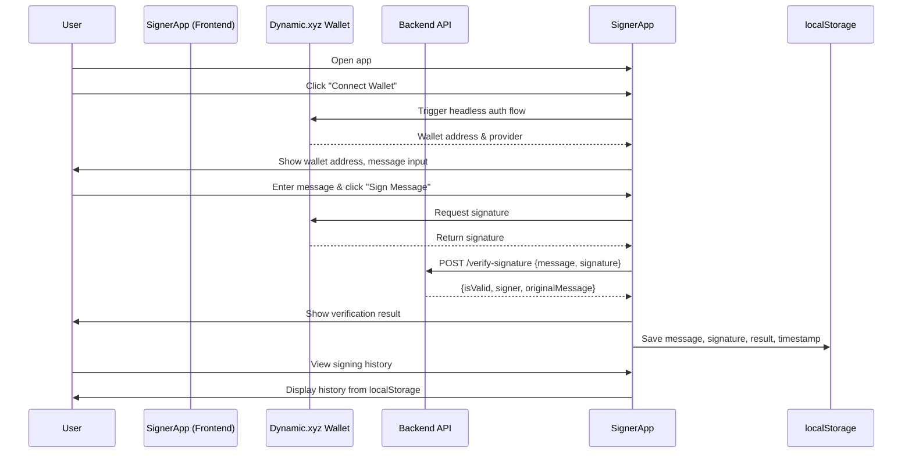

# Signer App Documentation

## Setup Instructions

### 1. **Clone the Repository**
```sh
git clone https://github.com/Nitin-477/signer.git
cd signer
```

### 2. **Install Dependencies**
```sh
npm install
```

### 3. **Configure Environment Variables**
- Create a `.env` file in the project root.
- Add your Dynamic.xyz environment ID:
  ```
  VITE_DYNAMIC_ID=your_dynamic_xyz_environment_id
  ```
- (Optional) If your backend is not running on `http://localhost:3000`, add:
  ```
  VITE_API_BASE=http://your-backend-url
  ```

### 4. **Run the App in Development**
```sh
npm run dev
```
- The app will be available at [http://localhost:5173](http://localhost:5173) (or as shown in your terminal).

### 5. **Build for Production**
```sh
npm run build
```

### 6. **Preview Production Build**
```sh
npm run preview
```

---

## Overview

The **Signer App** is a React-based frontend for a full-stack Web3 application. It enables users to:

- Authenticate via the Dynamic.xyz Headless Embedded Wallet.
- Enter and sign custom messages with their connected wallet.
- Send signed messages to a backend for verification.
- Display verification results (validity and signer address).
- Maintain a local signing history for multiple messages.

---

## Features & Capabilities

- **Headless Wallet Authentication:**  
  Users connect their Ethereum wallet using Dynamic.xyz's headless embedded wallet (no widget UI).

- **Message Signing:**  
  Users can input any message and sign it using their connected wallet.

- **Signature Verification:**  
  The app sends the signed message and signature to a backend API, which verifies the signature and returns the result.

- **Result Display:**  
  The app displays whether the signature is valid, the signer's address, and the original message.

- **Signing History:**  
  All signed messages, signatures, verification results, and timestamps are stored in localStorage and displayed in a history list.

---

## Working Flow (with Mermaid Diagram)



---

## Flow Chart

```mermaid
flowchart TD
  A[User opens app] --> B["Clicks &quot;Connect Wallet&quot;"]
  B --> C[Dynamic.xyz Headless Auth Flow]
  C --> D[Wallet Connected]
  D --> E[User enters message]
  E --> F["User clicks &quot;Sign Message&quot;"]
  F --> G[Wallet signs message]
  G --> H[Signature returned]
  H --> I["Send &#123;message, signature&#125; to backend"]
  I --> J[Backend verifies signature]
  J --> K[Return verification result]
  K --> L[Show result to user]
  L --> M[Save to local signing history]
  M --> N[User can view signing history]


```



---

## Component Structure

- **DynamicWallet**  
  Handles wallet connection and authentication using Dynamic.xyz SDK.  
  Passes the connected wallet and provider to the parent component.

- **MessageForm**  
  - Accepts the wallet provider and address as props.
  - Lets the user input a message and sign it.
  - Sends the signed message to the backend for verification.
  - Displays the signature, verification result, and signing history.

---

## How It Works

1. **Wallet Connection**
   - User clicks "Connect Wallet".
   - The app triggers the Dynamic.xyz headless authentication flow.
   - On success, the wallet address and provider are passed to the app.

2. **Message Signing**
   - User enters a message and clicks "Sign Message".
   - The app uses the wallet provider to sign the message.
   - The signature is displayed.

3. **Signature Verification**
   - The app sends `{ message, signature }` to the backend API.
   - The backend verifies the signature and returns `{ isValid, signer, originalMessage }`.
   - The result is displayed to the user.

4. **Signing History**
   - Each signed message, signature, verification result, and timestamp are saved to localStorage.
   - The history is displayed in a list, showing verification status for each entry.

---

## API Integration

- **POST /verify-signature**
  - Request: `{ message: string, signature: string }`
  - Response: `{ isValid: boolean, signer: string, originalMessage: string }`

---

## Local Storage

- Signing history is persisted in the browser's localStorage under the key `signHistory`.
- On app load, history is loaded and displayed.

---

## Error Handling

- Errors during signing or verification are displayed to the user.
- If no signer is available, an error is shown.

---

## Notes on Trade-offs and Potential Improvements

### Trade-offs

- **Headless Wallet Integration**
  - *Trade-off:* Using Dynamic.xyz’s headless wallet provides a seamless, branded user experience, but it ties your app to a third-party service and its API stability/pricing.
  - *Alternative:* Supporting multiple wallet providers (e.g., WalletConnect, MetaMask) would increase flexibility but add complexity.

- **LocalStorage for History**
  - *Trade-off:* Storing signing history in localStorage is simple and fast, but it’s device/browser-specific and not secure or shareable.
  - *Alternative:* Use a backend or encrypted storage for persistent, cross-device history.

- **No Global State Management**
  - *Trade-off:* Using React state and props keeps things simple for a small app, but as the app grows, state management (e.g., Redux, Zustand, or Context API) may be needed for scalability and maintainability.

- **Minimal Error Handling**
  - *Trade-off:* Basic error messages are shown, but there’s no granular feedback for different error types (network, wallet, backend, etc.).
  - *Alternative:* Implement more detailed error boundaries and user feedback.

- **No Input Validation Beyond Required**
  - *Trade-off:* The app only checks for non-empty messages. There’s no length limit, XSS protection, or special character filtering.
  - *Alternative:* Add input validation and sanitization for better UX and security.

- **No Rate Limiting or Abuse Protection**
  - *Trade-off:* The backend endpoint is open to unlimited requests, which could be abused.
  - *Alternative:* Add rate limiting, authentication, or CAPTCHA for public deployments.

- **No Mobile-First Navigation**
  - *Trade-off:* The app is responsive, but there’s no mobile navigation or menu for multi-page expansion.
  - *Alternative:* Add a responsive navbar or drawer if you plan to scale to more features/pages.

### Potential Improvements

- **Testing Coverage**
  - Add more comprehensive unit and integration tests, especially for wallet connection, signing, and error scenarios.

- **Accessibility**
  - Improve accessibility (a11y) by adding ARIA labels, keyboard navigation, and better focus management.

- **UI/UX Enhancements**
  - Add loading spinners, success/error toasts, and copy-to-clipboard for signatures.
  - Consider dark mode support.

- **Security**
  - Sanitize and validate all user input.
  - Consider encrypting sensitive data in localStorage or moving to secure backend storage.

- **Backend Integration**
  - Support for multiple backend environments (dev, staging, prod) via environment variables.
  - Add authentication for backend endpoints if needed.

- **Code Quality**
  - Use TypeScript strict mode for better type safety.
  - Refactor repeated logic into reusable hooks/components.

- **Performance**
  - Lazy-load heavy components if the app grows.
  - Use React.memo or useCallback where appropriate.

- **Documentation**
  - Add more usage examples, troubleshooting, and FAQ to the README.
  - Document environment variables and configuration options.

- **CI/CD**
  - Add GitHub Actions or another CI pipeline for linting, testing, and deployment.

---