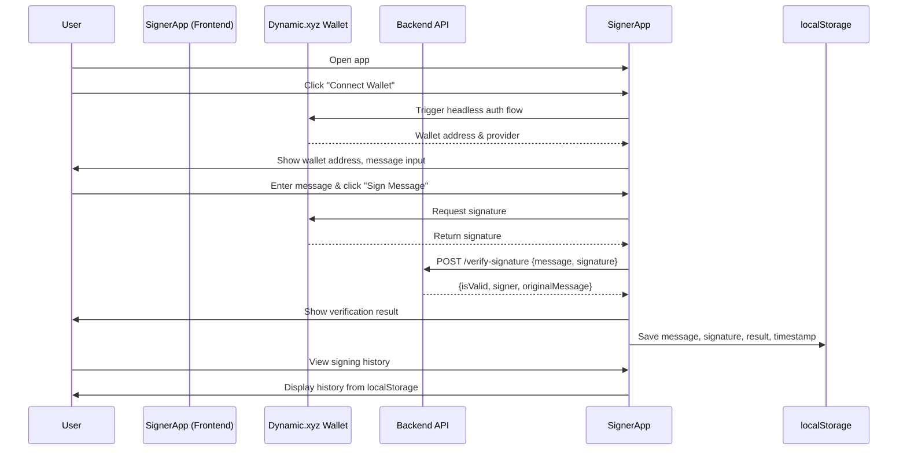

# Signer App Documentation

---

## Overview

The **Signer App** is a React-based frontend for a full-stack Web3 application. It enables users to:

- Authenticate via the Dynamic.xyz Headless Embedded Wallet.
- Enter and sign custom messages with their connected wallet.
- Send signed messages to a backend for verification.
- Display verification results (validity and signer address).
- Maintain a local signing history for multiple messages.

---

## Features & Capabilities

- **Headless Wallet Authentication:**  
  Users connect their Ethereum wallet using Dynamic.xyz's headless embedded wallet (no widget UI).

- **Message Signing:**  
  Users can input any message and sign it using their connected wallet.

- **Signature Verification:**  
  The app sends the signed message and signature to a backend API, which verifies the signature and returns the result.

- **Result Display:**  
  The app displays whether the signature is valid, the signer's address, and the original message.

- **Signing History:**  
  All signed messages, signatures, verification results, and timestamps are stored in localStorage and displayed in a history list.

---

## Working Flow (with Mermaid Diagram)

---

## Flow Chart

```mermaid
flowchart TD
  A[User opens app] --> B["Clicks &quot;Connect Wallet&quot;"]
  B --> C[Dynamic.xyz Headless Auth Flow]
  C --> D[Wallet Connected]
  D --> E[User enters message]
  E --> F["User clicks &quot;Sign Message&quot;"]
  F --> G[Wallet signs message]
  G --> H[Signature returned]
  H --> I["Send &#123;message, signature&#125; to backend"]
  I --> J[Backend verifies signature]
  J --> K[Return verification result]
  K --> L[Show result to user]
  L --> M[Save to local signing history]
  M --> N[User can view signing history]


```

---

## Component Structure

- **DynamicWallet**  
  Handles wallet connection and authentication using Dynamic.xyz SDK.  
  Passes the connected wallet and provider to the parent component.

- **MessageForm**  
  - Accepts the wallet provider and address as props.
  - Lets the user input a message and sign it.
  - Sends the signed message to the backend for verification.
  - Displays the signature, verification result, and signing history.

---

## How It Works

1. **Wallet Connection**
   - User clicks "Connect Wallet".
   - The app triggers the Dynamic.xyz headless authentication flow.
   - On success, the wallet address and provider are passed to the app.

2. **Message Signing**
   - User enters a message and clicks "Sign Message".
   - The app uses the wallet provider to sign the message.
   - The signature is displayed.

3. **Signature Verification**
   - The app sends `{ message, signature }` to the backend API.
   - The backend verifies the signature and returns `{ isValid, signer, originalMessage }`.
   - The result is displayed to the user.

4. **Signing History**
   - Each signed message, signature, verification result, and timestamp are saved to localStorage.
   - The history is displayed in a list, showing verification status for each entry.

---

## API Integration

- **POST /verify-signature**
  - Request: `{ message: string, signature: string }`
  - Response: `{ isValid: boolean, signer: string, originalMessage: string }`

---

## Local Storage

- Signing history is persisted in the browser's localStorage under the key `signHistory`.
- On app load, history is loaded and displayed.

---

## Error Handling

- Errors during signing or verification are displayed to the user.
- If no signer is available, an error is shown.

---

## Summary

The Signer App provides a seamless, secure, and user-friendly interface for message signing and verification using a headless Web3 wallet. It is suitable for any dApp or service requiring cryptographic proof of wallet ownership and message integrity.